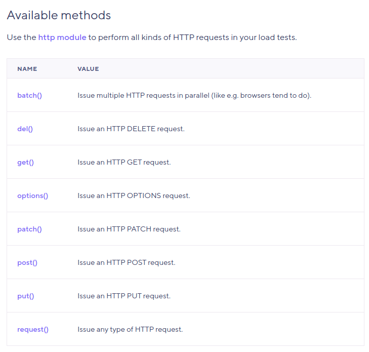
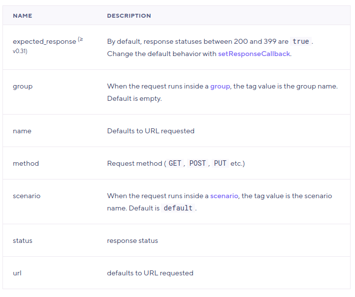
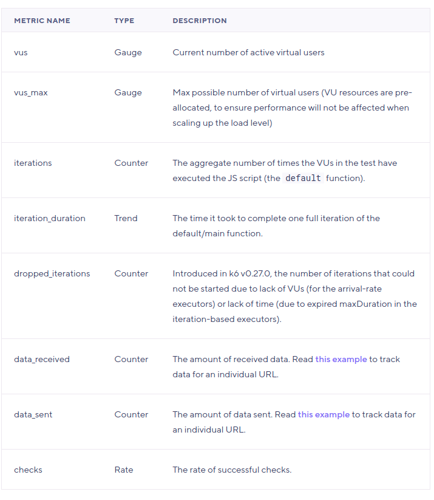
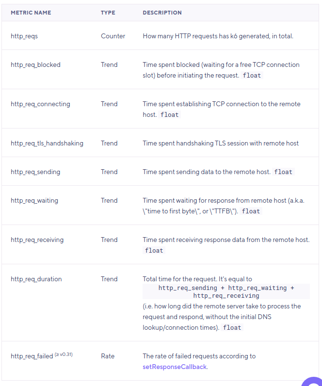
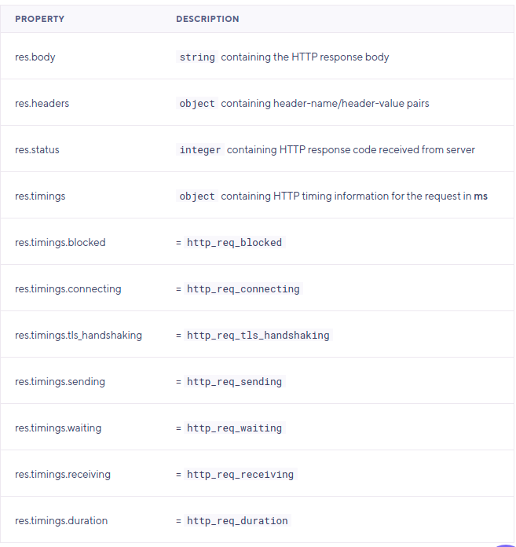
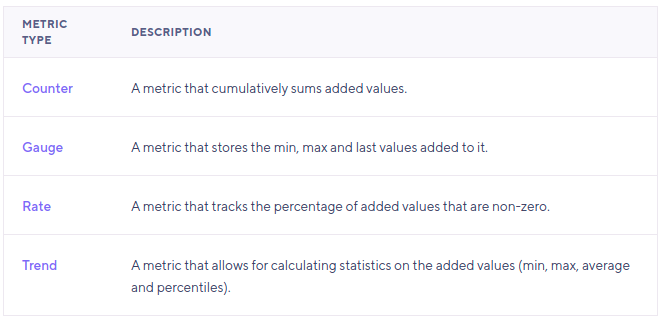
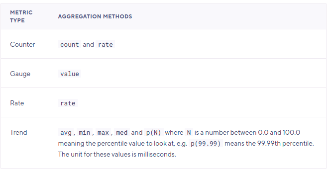
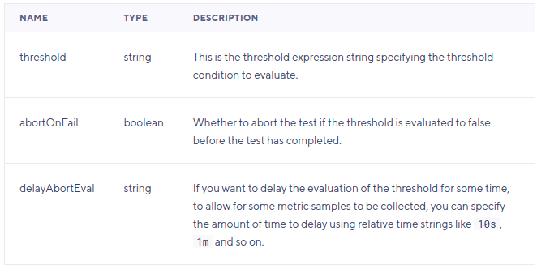

# React Design Patterns

</br>

## List of Contents:
### 1. [K6 Getting Started](#content-1)
### 2. [Using k6 - HTTP Requests](#content-2)
### 3. [Using k6 - Metrics](#content-3)
### 4. [Using k6 - Checks](#content-4)
### 5. [Using k6 - Thresholds](#content-5)


</br>

---

## Contents

## [K6 Getting Started](https://k6.io/docs/getting-started/) <span id="content-1"><span>

### Installation
- Using docker:
  ```shell
  docker pull loadimpact/k6
  ```

### Running k6
- First example:
  ```javascript
  import http from 'k6/http';
  import { sleep } from 'k6';

  export default function () {
    http.get('https://test.k6.io');
    sleep(1);
  }
  ```
- Run:
  ```shell
  # CLI
  k6 run script.js

  # Docker
  docker run -i loadimpact/k6 run - <script.js
  ```
- Run with more than 1 virtual users and longer duration:
  ```shell
  # CLI
  k6 run --vus 10 --duration 30s script.js

  # Docker
  docker run -i loadimpact/k6 run --vus 10 --duration 30s - <script.js
  ```
- k6 works with the concept of virtual users (VUs), which run scripts - they're essentially glorified, parallel while(true) loops.
- Scripts must contain, at the very least, a default function - this defines the entry point for your VUs,
- Code inside default is called "VU code", and is run over and over for as long as the test is running.
- Code outside of it is called "init code", and is run only once per VU.
  ```javascript
  // init code

  export default function() {
    // vu code
  }
  ```
- VU code can make HTTP requests, emit metrics, and generally do everything you'd expect a load test to do - with a few important exceptions: you can't load anything from your local filesystem, or import any other modules. This all has to be done from init-code.
- If you want to avoid having to type --vus 10 and --duration 30s all the time, you can include those settings inside your JavaScript file also:
  ```javascript
  import http from 'k6/http';
  import { sleep } from 'k6';
  export let options = {
    vus: 10,
    duration: '30s',
  };
  export default function () {
    http.get('http://test.k6.io');
    sleep(1);
  }
  ```
- You can also have the VU level ramp up and down during the test. The options.stages property allows you to configure ramping behaviour.
  ```javascript
  import http from 'k6/http';
  import { check, sleep } from 'k6';

  export let options = {
    stages: [
      { duration: '30s', target: 20 },
      { duration: '1m30s', target: 10 },
      { duration: '20s', target: 0 },
    ],
  };

  export default function () {
    let res = http.get('https://httpbin.org/');
    check(res, { 'status was 200': (r) => r.status == 200 });
    sleep(1);
  }
  ```

### Results output
- k6 run has two different ways of showing the results of a load test. By default, we show an aggregated summary report at the end of the test. This report is customizable, but by default features a general overview of all groups, checks and thresholds in the load test, as well as aggregated values for all built-in and custom metrics used in the test run.
- When k6 displays the results to stdout, it will show the k6 logo and the following test information:
  - Test details: general test information and load options.
  - Progress bar: test status and how much time has passed.
  - Test summary: the test results (after test completion). Since k6 v0.30.0, it is possible to completely customize the output and redirect it to a file. It is also possible to save arbitrary files with machine-readable versions of the summary, like JSON, XML (e.g. JUnit, XUnit, etc.), or even nicely-formatted HTML reports meant for humans! For more details, see the handleSummary() docs.
- Test details
  - execution: local shows the k6 execution mode (local or cloud).
  - output: - is the output of the granular test results. By default, no output is used, only the aggregated end-of-test summary is shown.
  - script: path/to/script.js shows the name of the script file that is being executed
  - scenarios: ... is a summary of the scenarios that will be executed this test run and some overview information:
    - (100.00%) is the used execution segment
    - 50 max VUs tells us up to how many VUs (virtual users) will be used across all scenarios.
    - 5m30s max duration is the maximum time the script will take to run, including any graceful stop times.
  - * default: ... describes the only scenario for this test run. In this case it's a scenario with a ramping VUs executor, specified via the stages shortcut option instead of using the scenarios long-form option.

### End-of-test summary report
- The test summary provides a general overview of your test results. By default, the summary prints to stdout the status of all:
  - Aggregated values for the built-in metrics and custom metrics.
  - Checks and thresholds.
  - Groups and tags.
- As of k6 v0.30.0, it's possible to completely customize the summary shown to stdout, redirect it to a file or stderr, or build and export your own completely custom report (e.g. HTML, JSON, JUnit/XUnit XML, etc.) via the new handleSummary() callback.
- Output example:
  ```text
  data_received..............: 148 MB 2.5 MB/s
  data_sent..................: 1.0 MB 17 kB/s
  http_req_blocked...........: avg=1.92ms   min=1µs      med=5µs      max=288.73ms p(90)=11µs     p(95)=17µs
  http_req_connecting........: avg=1.01ms   min=0s       med=0s       max=166.44ms p(90)=0s       p(95)=0s
  http_req_duration..........: avg=143.14ms min=112.87ms med=136.03ms max=1.18s    p(90)=164.2ms  p(95)=177.75ms
  http_req_receiving.........: avg=5.53ms   min=49µs     med=2.11ms   max=1.01s    p(90)=9.25ms   p(95)=11.8ms
  http_req_sending...........: avg=30.01µs  min=7µs      med=24µs     max=1.89ms   p(90)=48µs     p(95)=63µs
  http_req_tls_handshaking...: avg=0s       min=0s       med=0s       max=0s       p(90)=0s       p(95)=0s
  http_req_waiting...........: avg=137.57ms min=111.44ms med=132.59ms max=589.4ms  p(90)=159.95ms p(95)=169.41ms
  http_reqs..................: 13491  224.848869/s
  iteration_duration.........: avg=445.48ms min=413.05ms med=436.36ms max=1.48s    p(90)=464.94ms p(95)=479.66ms
  iterations.................: 13410  223.498876/s
  vus........................: 100    min=100 max=100
  vus_max....................: 100    min=100 max=100
  ```


**[⬆ back to top](#list-of-contents)**

</br>

---

## [Using k6 - HTTP Requests](https://k6.io/docs/using-k6/http-requests/) <span id="content-2"><span>

### Making HTTP Requests
- Get example:
  ```javascript
  import http from 'k6/http';

  export default function () {
    http.get('http://test.k6.io');
  }
  ```
- Post example:
  ```javascript
  import http from 'k6/http';

  export default function () {
    var url = 'http://test.k6.io/login';
    var payload = JSON.stringify({
      email: 'aaa',
      password: 'bbb',
    });

    var params = {
      headers: {
        'Content-Type': 'application/json',
      },
    };

    http.post(url, payload, params);
  }
  ```

### Available methods



### HTTP Request Tags
- k6 will automatically apply tags to your HTTP requests. These tags allow you to filter your results during analysis.
- List:
  
- Result example:
  ```json
  {
    "type": "Point",
    "metric": "http_req_duration",
    "data": {
      "time": "2017-06-02T23:10:29.52444541+02:00",
      "value": 586.831127,
      "tags": {
        "expected_response": "true",
        "group": "",
        "method": "GET",
        "name": "http://test.k6.io",
        "scenario": "default",
        "status": "200",
        "url": "http://test.k6.io"
      }
    }
  }
  ```

### URL Grouping
- Example:
  ```javascript
  for (var id = 1; id <= 100; id++) {
    http.get(`http://example.com/posts/${id}`, {
      tags: { name: 'PostsItemURL' },
    });
  }

  // tags.name=\"PostsItemURL\",
  // tags.name=\"PostsItemURL\",
  ```
- JSON result:
  ```json
  {
      "type":"Point",
      "metric":"http_req_duration",
      "data": {
          "time":"2017-06-02T23:10:29.52444541+02:00",
          "value":586.831127,
          "tags": {
              "method":"GET",
              "name":"PostsItemURL",
              "status":"200",
              "url":"http://example.com/1"
          }
      }
  }

  // and

  {
      "type":"Point",
      "metric":"http_req_duration",
      "data": {
          "time":"2017-06-02T23:10:29.58582529+02:00",
          "value":580.839273,
          "tags": {
              "method":"GET",
              "name":"PostsItemURL",
              "status":"200",
              "url":"http://example.com/2"
          }
      }
  }

  ```
- Note how the name is the same for the two data samples related to two different URLs. Filtering the results on tag name: PostsItemURL will give you a result set including all the data points from all the 100 different URLs.


**[⬆ back to top](#list-of-contents)**

</br>

---


## [Using k6 - Metrics](https://k6.io/docs/using-k6/metrics/) <span id="content-3"><span>


### Built-in metrics
- The following built-in metrics will always be collected by k6:
  


### HTTP-specific built-in metrics
- built-in metrics will only be generated when/if HTTP requests are made:
  
- Accessing HTTP timings from a script:
  ```javascript
  import http from 'k6/http';
  export default function () {
    var res = http.get('http://httpbin.org');
    console.log('Response time was ' + String(res.timings.duration) + ' ms');
  }
  ```
- Response object:
  


### Custom metrics
- Example:
  ```javascript
  import http from 'k6/http';
  import { Trend } from 'k6/metrics';

  let myTrend = new Trend('waiting_time');

  export default function () {
    let r = http.get('https://httpbin.org');
    myTrend.add(r.timings.waiting);
    console.log(myTrend.name);  // waiting_time
  }
  ```

### Metric types
- All metrics (both the built-in ones and the custom ones) have a type. The four different metric types in k6 are:
  
- Counter (cumulative metric)
  ```javascript
  import { Counter } from 'k6/metrics';

  let myCounter = new Counter('my_counter');

  export default function () {
    myCounter.add(1);
    myCounter.add(2);
  }
  ```

### Gauge (keep the latest value only)
- Example:
  ```javascript
  import { Gauge } from 'k6/metrics';

  let myGauge = new Gauge('my_gauge');

  export default function () {
    myGauge.add(3);
    myGauge.add(1);
    myGauge.add(2);
  }
  ```
- The value of my_gauge will be 2 at the end of the test. As with the Counter metric above, a Gauge with value zero (0) will NOT be printed to the stdout summary at the end of the test.

### Trend (collect trend statistics (min/max/avg/percentiles) for a series of values)
- Example:
  ```javascript
  import { Trend } from 'k6/metrics';

  let myTrend = new Trend('my_trend');

  export default function () {
    myTrend.add(1);
    myTrend.add(2);
  }
  ```
- A trend metric is a container that holds a set of sample values, and which we can ask to output statistics (min, max, average, median or percentiles) about those samples. By default, k6 will print average, min, max, median, 90th percentile, and 95th percentile.


### Rate (keeps track of the percentage of values in a series that are non-zero)
- Example:
  ```javascript
  import { Rate } from 'k6/metrics';

  let myRate = new Rate('my_rate');

  export default function () {
    myRate.add(true);
    myRate.add(false);
    myRate.add(1);
    myRate.add(0);
  }
  ```
- The value of my_rate at the end of the test will be 50%, indicating that half of the values added to the metric were non-zero.


**[⬆ back to top](#list-of-contents)**

</br>

---

## [Using k6 - Checks](https://k6.io/docs/using-k6/checks/) <span id="content-4"><span>

### What is a check?
- Checks are like asserts but differ in that they don't halt the execution, instead, they just store the result of the check, pass or fail, and let the script execution continue.
- Checks are great for codifying assertions relating to HTTP requests/responses, making sure the response code is 2xx for example:
  ```javascript
  import { check } from 'k6';
  import http from 'k6/http';

  export default function () {
    let res = http.get('http://test.k6.io/');
    check(res, {
      'is status 200': (r) => r.status === 200,
    });
  }
  ```
- In the above example, one check was specified but you can add as many as you need in a call to check().
- Multiple checks:
  ```javascript
  import { check } from 'k6';
  import http from 'k6/http';

  export default function () {
    let res = http.get('http://test.k6.io/');
    check(res, {
      'is status 200': (r) => r.status === 200,
      'body size is 1176 bytes': (r) => r.body.length == 1176,
    });
  }
  ```

### Using checks in a CI setting
- One important thing to understand regarding checks is that a failed check will not fail the whole load test.
- Checks help to keep your code organized and easy to read, but when you're running a load test in a CI test suite you may want to check for error conditions that fail the whole load test. In this case you may want to combine checks with thresholds to get what you want:
  ```javascript
  import http from 'k6/http';
  import { check } from 'k6';
  import { Rate } from 'k6/metrics';

  export let errorRate = new Rate('errors');
  export let options = {
    thresholds: {
      errors: ['rate<0.1'], // <10% errors
    },
  };

  export default function () {
    const res = http.get('http://httpbin.org');
    const result = check(res, {
      'status is 200': (r) => r.status == 200,
    });

    errorRate.add(!result);
  }
  ```
- The above script declares a custom Rate metric (called "errors") to hold information about the errors we have seen during the test, then it uses a threshold on that custom metric to fail the test when it encounters too many errors.


**[⬆ back to top](#list-of-contents)**

</br>

---


## [Using k6 - Thresholds](https://k6.io/docs/using-k6/thresholds/) <span id="content-5"><span>

### What are thresholds?
- Thresholds are a pass/fail criteria used to specify the performance expectations of the system under test.
- Thresholds analyze the performance metrics and determine the final test result (pass/fail). Thresholds are a essential for load-testing automation.
- Here is a sample script that specifies two thresholds, one evaluating the rate of http errors (http_req_failed metric) and one using the 95 percentile of all the response durations (the http_req_duration metric)
  ```javascript
  import http from 'k6/http';

  export let options = {
    thresholds: {
      http_req_failed: ['rate<0.01'],   // http errors should be less than 1% 
      http_req_duration: ['p(95)<200'], // 95% of requests should be below 200ms
    },
  };

  export default function () {
    http.get('https://test-api.k6.io/public/crocodiles/1/');
  }
  ```
- In other words, you specify the pass criteria when defining your threshold, and if that expression evaluates to false at the end of the test, the whole test will be considered a fail.
- In the above case, the criteria for both thresholds were met. The whole load test is considered to be a pass, which means that k6 will exit with exit code zero.
- If any of the thresholds had failed, the little green checkmark ✓ next to the threshold name (http_req_failed, http_req_duration) would have been a red cross ✗ instead, and k6 would have generated a non-zero exit code.

### Copy-paste Threshold examples
- Example:
  ```javascript
  import http from 'k6/http';
  import { sleep } from 'k6';

  export let options = {
    thresholds: {
      // 90% of requests must finish within 400ms.
      http_req_duration: ['p(90) < 400'],
    },
  };

  export default function () {
    http.get('https://test-api.k6.io/public/crocodiles/1/');
    sleep(1);
  }
  ```
- - Example:
  ```javascript
  import http from 'k6/http';
  import { sleep } from 'k6';

  export let options = {
    thresholds: {
      // During the whole test execution, the error rate must be lower than 1%.
      // `http_req_failed` metric is available since v0.31.0
      http_req_failed: ['rate<0.01'],
    },
  };

  export default function () {
    http.get('https://test-api.k6.io/public/crocodiles/1/');
    sleep(1);
  }
  ```
- Multiple threshold example:
  ```javascript
  import http from 'k6/http';
  import { sleep } from 'k6';

  export let options = {
    thresholds: {
      // 90% of requests must finish within 400ms, 95% within 800, and 99.9% within 2s.
      http_req_duration: ['p(90) < 400', 'p(95) < 800', 'p(99.9) < 2000'],
    },
  };

  export default function () {
    let res1 = http.get('https://test-api.k6.io/public/crocodiles/1/');
    sleep(1);
  }
  ```
- Threshold on group durations:
  ```javascript
  import http from 'k6/http';
  import { group, sleep } from 'k6';

  export let options = {
    thresholds: {
      'group_duration{group:::individualRequests}': ['avg < 200'],
      'group_duration{group:::batchRequests}': ['avg < 200'],
    },
    vus: 1,
    duration: '10s',
  };

  export default function () {
    group('individualRequests', function () {
      http.get('https://test-api.k6.io/public/crocodiles/1/');
      http.get('https://test-api.k6.io/public/crocodiles/2/');
      http.get('https://test-api.k6.io/public/crocodiles/3/');
    });

    group('batchRequests', function () {
      http.batch([
        ['GET', `https://test-api.k6.io/public/crocodiles/1/`],
        ['GET', `https://test-api.k6.io/public/crocodiles/2/`],
        ['GET', `https://test-api.k6.io/public/crocodiles/3/`],
      ]);
    });

    sleep(1);
  }
  ```

### Threshold Syntax
- Format:
  ```javascript
  export let options = {
    thresholds: {
      metric_name1: [ 'threshold_expression', ... ], // short format
      metric_name1: [ { threshold: 'threshold_expression', abortOnFail: boolean, delayAbortEval: string }, ], // full format
    }
  };
  ```
- The above declaration inside a k6 script means that there will be a threshold configured for the metric metric_name1. To determine if the threshold has failed or passed, the string 'threshold_expression' will be evaluated. The 'threshold_expression' must follow the following format: aggregation_method operator value
- Examples:
  - avg < 200 // average duration can't be larger than 200ms
  - count >= 500 // count must be larger or equal to 500
  - p(90) < 300 // 90% of samples must be below 300
- Threshold expression:
  
- sample script:
  ```javascript
  import http from 'k6/http';
  import { Trend, Rate, Counter, Gauge } from 'k6/metrics';
  import { sleep } from 'k6';

  export let TrendRTT = new Trend('RTT');
  export let RateContentOK = new Rate('Content OK');
  export let GaugeContentSize = new Gauge('ContentSize');
  export let CounterErrors = new Counter('Errors');
  export let options = {
    thresholds: {
      RTT: ['p(99)<300', 'p(70)<250', 'avg<200', 'med<150', 'min<100'],
      'Content OK': ['rate>0.95'],
      ContentSize: ['value<4000'],
      Errors: ['count<100'],
    },
  };

  export default function () {
    let res = http.get('https://test-api.k6.io/public/crocodiles/1/');
    let contentOK = res.json('name') === 'Bert';

    TrendRTT.add(res.timings.duration);
    RateContentOK.add(contentOK);
    GaugeContentSize.add(res.body.length);
    CounterErrors.add(!contentOK);

    sleep(1);
  }
  ```

### Thresholds on tags
- It's often useful to specify thresholds only on a single URL or a specific tag. In k6, tagged requests create sub-metrics that can be used in thresholds as shown below.
- Example:
  ```javascript
  import http from 'k6/http';
  import { sleep } from 'k6';
  import { Rate } from 'k6/metrics';

  export let options = {
    thresholds: {
      'http_req_duration{type:API}': ['p(95)<500'], // threshold on API requests only
      'http_req_duration{type:staticContent}': ['p(95)<200'], // threshold on static content only
    },
  };

  export default function () {
    let res1 = http.get('https://test-api.k6.io/public/crocodiles/1/', {
      tags: { type: 'API' },
    });
    let res2 = http.get('https://test-api.k6.io/public/crocodiles/2/', {
      tags: { type: 'API' },
    });

    let responses = http.batch([
      [
        'GET',
        'https://test-api.k6.io/static/favicon.ico',
        null,
        { tags: { type: 'staticContent' } },
      ],
      [
        'GET',
        'https://test-api.k6.io/static/css/site.css',
        null,
        { tags: { type: 'staticContent' } },
      ],
    ]);

    sleep(1);
  }
  ```

### Aborting a test when a threshold is crossed
- If you want to abort a test as soon as a threshold is crossed, before the test has completed, there's an extended threshold specification format that looks like this:
- Example:
  ```javascript
  import http from 'k6/http';

  export let options = {
    vus: 30,
    duration: '2m',
    thresholds: {
      http_req_duration: [{threshold: 'p(99) < 10', abortOnFail: true}]
    },
  };

  export default function () {
    http.get('https://test-api.k6.io/public/crocodiles/1/');
  }
  ```
- Fields for threshold:
  

### Failing a load test using checks
- Checks are nice for codifying assertions, but unlike thresholds, checks will not affect the exit status of k6.
- If you only use checks to verify that things work as expected, you will not be able to fail the whole test run based on the results of those checks.
- It can often be useful to combine checks and thresholds, to get the best of both:
  ```javascript
  import http from 'k6/http';
  import { check, sleep } from 'k6';

  export let options = {
    vus: 50,
    duration: '10s',
    thresholds: {
      // the rate of successful checks should be higher than 90%
      checks: ['rate>0.9'],
    },
  };

  export default function () {
    const res = http.get('http://httpbin.org');

    check(res, {
      'status is 500': (r) => r.status == 500,
    });

    sleep(1);
  }
  ```
- Full example:
  ```javascript
  import http from 'k6/http';
  import { check, sleep } from 'k6';

  export let options = {
    vus: 50,
    duration: '10s',
    thresholds: {
      'checks{myTag:hola}': ['rate>0.9'],
    },
  };

  export default function () {
    let res;

    res = http.get('http://httpbin.org');
    check(res, {
      'status is 500': (r) => r.status == 500,
    });

    res = http.get('http://httpbin.org');
    check(
      res,
      {
        'status is 200': (r) => r.status == 200,
      },
      { myTag: 'hola' },
    );

    sleep(1);
  }
  ```


**[⬆ back to top](#list-of-contents)**

</br>

---
## References:
- https://k6.io/docs/getting-started/
- https://k6.io/docs/using-k6/http-requests/
- https://k6.io/docs/using-k6/metrics/
- https://k6.io/docs/using-k6/checks/
- https://k6.io/docs/using-k6/thresholds/